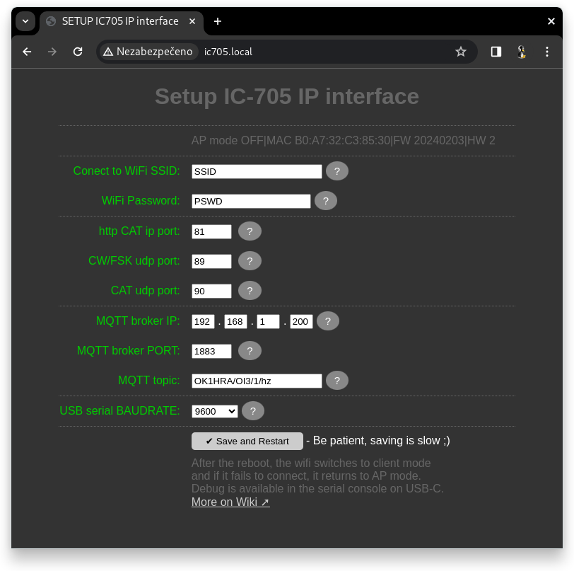
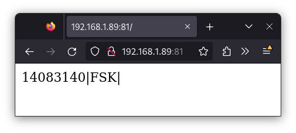

# IC-705 IP Interface — User Manual

## Table of Contents

1. [Quick Start Guide](#1-quick-start-guide)
2. [Firmware Update](#2-firmware-update)
3. [Setup Page](#3-setup-page)
4. [CAT Page](#4-cat-page)
5. [QRPLog — Contest Log](#5-qrplog--contest-log)
6. [LOGSYNC — Log Synchronisation](#6-logsync--log-synchronisation)
7. [DEBUG Page](#7-debug-page)
8. [Status LED Reference](#8-status-led-reference)
9. [Advanced Features](#9-advanced-features)
10. [Troubleshooting](#10-troubleshooting)

---

## 1. Quick Start Guide

Power on the device → connect to its WiFi → configure your home WiFi and Bluetooth → done.

### Step 1 — Power on

Connect 13.8 V DC to the barrel jack. The status LED starts slowly fading in and out — the device is in **AP mode** and waiting for initial configuration.

### Step 2 — Connect to the device's WiFi

On your phone or laptop, connect to the WiFi network named **`ic705`** (no password).

### Step 3 — Open the Setup page

Open a browser and go to **`http://ic705.local`** (or `http://192.168.4.1` if mDNS does not work on your device — see [Troubleshooting](#10-troubleshooting)).

You will land on the **SETUP** tab automatically in AP mode.

### Step 4 — Configure your home WiFi

Under **WiFi**, enter your home network name and password in the **SSID 1 / Password 1** fields. A second network (SSID 2) is optional.

Click **Save** at the bottom of the page.

### Step 5 — Reconnect

The device reboots and joins your home WiFi. The status LED turns **off** when connected.

Reconnect your laptop/phone to your home WiFi and open **`http://ic705.local`** again.

### Step 6 — Pair with IC-705

On the IC-705, enable Bluetooth:
- **Menu → Set → Bluetooth Set → Bluetooth** → ON
- **Menu → Set → Bluetooth Set → Pairing/Connect** → select the device named **IC-705** in the list

After pairing, the **POWER-OUT** output (13.8 V, 0.5 A) activates and a green LED on the board lights up.

### Step 7 — Start using it

Open **`http://ic705.local`** in your browser. The **CAT** tab shows the current frequency and mode from the radio.

---

## 2. Firmware Update

Use the web flasher — no Arduino IDE or USB drivers needed.

1. Connect the device to your PC via the **USB-C** cable.
2. Open the firmware page: **`https://ok1hra.github.io/IC-705_Interface/`**
3. Click **Connect** and select the serial port of the device.
4. Click **Install** and wait for the process to complete (~1 minute).
5. After flashing, the device reboots. Your EEPROM settings (WiFi, MQTT, etc.) are preserved.

> **Note:** Use a data-capable USB-C cable. Charge-only cables will not work.

---

## 3. Setup Page

The Setup page is available at **`http://ic705.local/setup`**.

All settings marked **eeprom** are stored in EEPROM and survive firmware updates.  
Settings marked **spiffs** are stored in the filesystem and also survive updates.



### WiFi

| Field | Description |
|-------|-------------|
| SSID 1 / Password 1 | Primary home WiFi network. Tried first after every reboot. |
| SSID 2 / Password 2 | Fallback network (optional). |

If neither network is reachable, the device falls back to AP mode.

### Network Ports

| Field | Default | Description |
|-------|---------|-------------|
| HTTP CAT port | 81 | Legacy CAT endpoint (`frequency\|mode\|`) for external loggers. |
| CW/FSK UDP port | 89 | Receives ASCII text and keys it as CW or FSK/RTTY. |
| CAT UDP port | 90 | Receives raw CI-V bytes (only RIT clear is implemented). |

### MQTT

| Field | Description |
|-------|-------------|
| Broker IP | IP address of your MQTT broker (four octets). |
| Broker port | Default: 1883. |
| Topic TX | MQTT topic the device publishes frequency/mode to. |
| Topic RX | MQTT topic the device subscribes to (reserved for future use). |

Leave the broker IP as `0.0.0.0` to disable MQTT publishing.

### Radio

Configure up to three transceivers (TRX1–TRX3):

| Field | Description |
|-------|-------------|
| Label | Name shown in the log UI (e.g. `IC-705`). |
| CI-V address | Hex address of the radio (default for IC-705: `0xA4`). |

### LOG Settings

| Field | Description |
|-------|-------------|
| Station callsign | Your callsign, used in CW/RTTY macros (`MYCALL`). |
| Contest exchange | Sent as your exchange in `TXEXCH` macros. |
| Manual mode for Phone | When checked, pressing Enter on SSB/FM logs immediately without sending any macro. |
| Blocked DXCC entities | One entity name per line; matching callsigns are highlighted red in the log. |

### CW Memories

Four free-text CW memory slots (M1–M4) available on the CAT page. Supports the same variable substitutions as macros (`{mycall}`, etc.).

### Frequency Memories

Ten frequency memory slots available on the CAT page.

---

## 4. CAT Page

The CAT page is the main radio-control view, available at **`http://ic705.local/`**.



### Status indicators

- **Frequency display** — current VFO frequency in MHz, updated in real time.
- **S meter / Power meter** — switches automatically between receive (S meter) and transmit (power/SWR).
- **Supply voltage** — 13.8 V supply reading from the device.
- **MODE selector** — change the radio mode (LSB, USB, AM, CW, RTTY, FM, DV).
- **RIT** — shows RIT offset; the **Clear** button zeroes it.
- **BT / WiFi status** — shown in the top bar alongside firmware version.

### Frequency memories

Click any of the ten memory buttons (M1–M10) to QSY to that frequency. Long-press (or right-click) to save the current frequency into a slot.

### CW memories

Four CW memory buttons (M1–M4) send pre-configured text via the radio's CW keyer. Edit the content in **Setup → CW memories**.

### TX indicator

The top bar flashes red while the radio is transmitting.

---

## 5. QRPLog — Contest Log

The QRPLog is a browser-based contest log available at **`http://ic705.local/log`**.

### Modes: RUN and S&P

Toggle between **RUN** (CQ-ing) and **S&P** (Search & Pounce) using the button in the bottom-left corner of the log.

| Mode | Enter key behaviour |
|------|---------------------|
| RUN | Sends CQ macro; after filling call + exchange, logs the QSO and sends TU. |
| S&P | Checks the callsign; Enter logs and sends exchange. |

### Entering a QSO

1. Type the callsign in the **Call** field. The log checks for duplicates automatically.
2. Fill in **RST** (pre-filled with `599`).
3. Fill in the **Exchange** field.
4. Press **Enter** to log and send the TU macro.

### CW/RTTY macros

Macros are generated automatically based on mode and RUN/S&P state:

| Macro | CW example | RTTY example |
|-------|-----------|--------------|
| CQ | `OK1HRA OK1HRA TEST` | `OK1HRA OK1HRA OK1HRA TEST` |
| TXEXCH | `{call} {serial} {exchange}` | same |
| TU | `tu OK1HRA` | `{call} tu OK1HRA` |

Variables `{mycall}`, `{call}`, `{serial}`, `{exchange}` are filled from your Setup configuration and the current QSO.

### Multi-TRX

The **TRX1 / TRX2 / TRX3** buttons switch the active transceiver. TRX2 and TRX3 require additional IP adapters configured in **Setup → Radio**.

### Log journal

The QSO list on the left shows all logged contacts. Click a call to search. Enable **global** to search across all log files.

### Log file management

Click the **LOG** button to open, create, or switch between log files. Each file is stored in the browser's local IndexedDB.

---

## 6. LOGSYNC — Log Synchronisation

LOGSYNC lets two devices on the same WiFi network exchange QSOs peer-to-peer. Available at **`http://ic705.local/datasync`**.

### Workflow

1. **Set a device label** (Step 1) — a human-readable name for this device (e.g. `Shack tablet`).
2. **Pair** (Step 2):
   - On the initiating device: click **Sync** and enter the IP address of the other device.
   - On the receiving device: an incoming offer appears — click **Accept**.
3. Watch the **Sync status** panel for progress (phase, sent, received, errors).

### Sync status fields

| Field | Meaning |
|-------|---------|
| Phase | Current sync state (Idle / Offer / Sync / Done). |
| Remote device | Label of the peer device. |
| Sent / Received | Number of QSOs exchanged in the current session. |
| Errors | Count of transmission errors (should be 0). |

---

## 7. DEBUG Page

The DEBUG page (`http://ic705.local/ws-cat`) shows a raw WebSocket stream of all CI-V frames passing between the ESP32 and the IC-705. Use it to verify that:

- The Bluetooth connection is active.
- Frequency and mode polling is working.
- Raw CI-V commands are being sent and acknowledged.

This page is intended for development and troubleshooting, not for daily use.

---

## 8. Status LED Reference

The single status LED on the device indicates the current state:

| LED behaviour | Meaning |
|---------------|---------|
| Slow fade in/out | AP mode — device is broadcasting its own WiFi, waiting for setup. |
| Steady ON | WiFi client mode, waiting to connect to the configured network. |
| OFF | WiFi connected to your home network. |
| Single flash | Sending frequency/mode to MQTT broker. |
| Double flash | CW message received via UDP (being keyed). |
| Flash + PTT | RTTY/FSK message received via UDP (PTT is active). |

---

## 9. Advanced Features

### MQTT frequency publishing

When a broker IP is configured in Setup, the device publishes a JSON message to the configured topic every time the frequency or mode changes:

```
{"freq":14074000,"mode":"USB"}
```

### UDP CW and RTTY/FSK keying (port 89)

External loggers (N1MM+, Win-Test) can send CW or RTTY text via UDP:

```bash
echo -n "cq de ok1hra;" | nc -u -w1 192.168.1.x 89
```

The device routes automatically: CW mode → IC-705 CW keyer; RTTY mode → FSK + PTT keying via GPIO.

### HTTP CAT endpoint (port 81)

Provides a simple frequency/mode readout for external software:

```
GET http://ic705.local:81/
→ 14074000|USB|
```

Returns `0|OFF|` when the radio is off or disconnected.

### POWER-OUT output

A 13.8 V / 0.5 A switched output activates automatically when Bluetooth connects to the IC-705. Use it to power accessory equipment (keyer, amplifier controller, etc.) that should follow the radio's on-state.

### Galvanically isolated CI-V output

The CI-V output on the ACC connector is optically isolated and carries frequency data for downstream devices (linear amplifiers, band decoders). Enable **CIV-MUTE** in firmware to pass only frequency commands — not debug traffic.

### Watchdog

The device resets automatically after 73 seconds of no Bluetooth activity. This prevents silent lock-ups without requiring a power cycle.

### mDNS hostname

The device advertises itself as **`ic705.local`** via mDNS. On Windows, mDNS requires iTunes or Bonjour to be installed. On Android, mDNS is not supported — use the IP address instead (find it via your router's DHCP table or the serial terminal).

---

## 10. Troubleshooting

### `ic705.local` not found in the browser

- **Windows:** Install Apple Bonjour (included with iTunes) or use the IP address directly.
- **Android:** mDNS is not supported. Find the IP address in your router's DHCP client list, or connect via USB and open the Arduino serial monitor at 9600 baud — press `?` + Enter to print the IP.
- **All platforms:** Try `http://192.168.4.1` when in AP mode.

### Status LED stays ON (never turns off)

The device cannot connect to the configured WiFi network. Check:
1. SSID and password in Setup — typos are common.
2. The router is in range and 2.4 GHz is enabled (ESP32 does not support 5 GHz).
3. If the network is not available, the device falls back to AP mode after ~30 seconds.

### Bluetooth does not pair with IC-705

1. On the IC-705: confirm **Bluetooth** is set to ON in the Bluetooth Set menu.
2. Delete any existing pairing on the IC-705 side and try again.
3. Make sure no other device (phone, PC) is already connected to the IC-705 via Bluetooth — the IC-705 supports only one BT connection at a time.

### Frequency shows `0.000.00` on the CAT page

The device is connected to WiFi but not yet paired with the IC-705 via Bluetooth. Check the BT status indicator in the top bar (`BT linked` = connected, `BT off` = not connected).

### Device resets every ~73 seconds

This is the watchdog firing because the Bluetooth connection to the IC-705 was lost. Check:
1. IC-705 is powered on and Bluetooth is enabled.
2. The device is within Bluetooth range (~10 m line-of-sight).

### CW is sent but the radio does not key

1. The radio must be in **CW** or **CW-R** mode — the device will not key in SSB modes.
2. Check that the CI-V address in Setup matches the IC-705's CI-V address (default `0xA4`).
3. Verify the CI-V transceive setting is enabled — the device sets this automatically on connect, but a power cycle of the IC-705 may reset it.

### MQTT messages not appearing

1. Confirm the broker IP and port in Setup are correct.
2. The broker must be reachable from the same WiFi network as the device.
3. Verify with `mosquitto_sub -t '#' -v` on the broker host to see if any messages arrive.

---

*Document generated from project IC-705_Interface — 2026-05-11*
