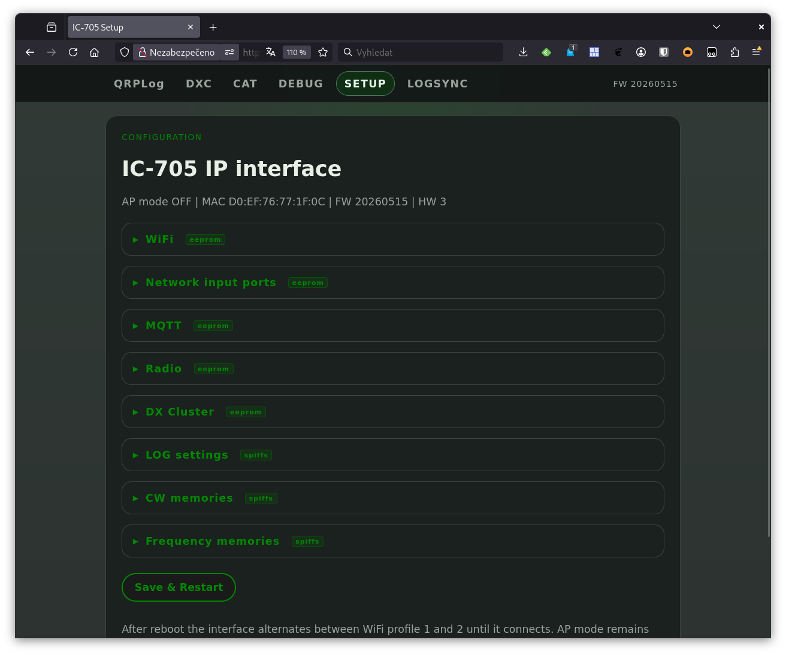
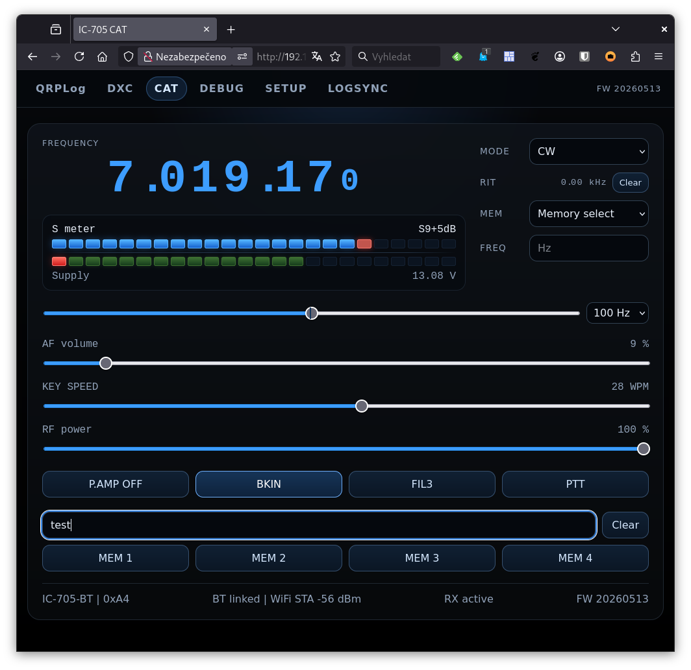
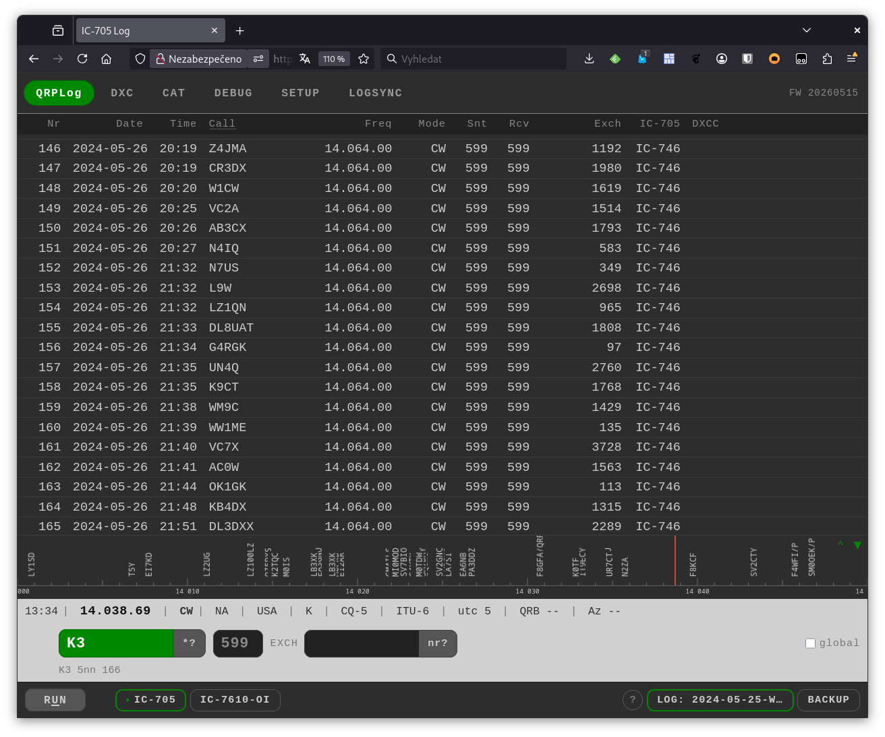
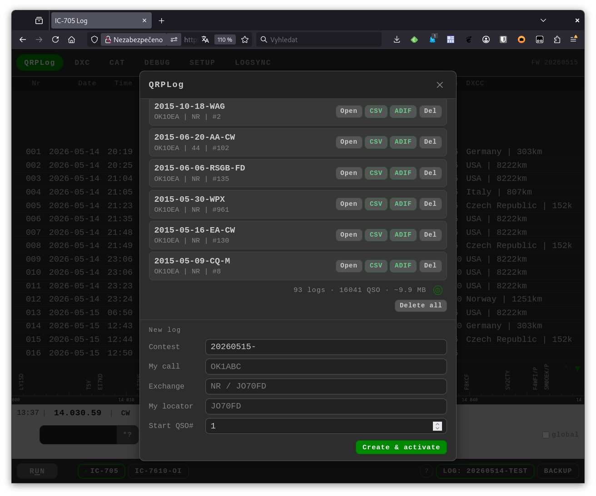
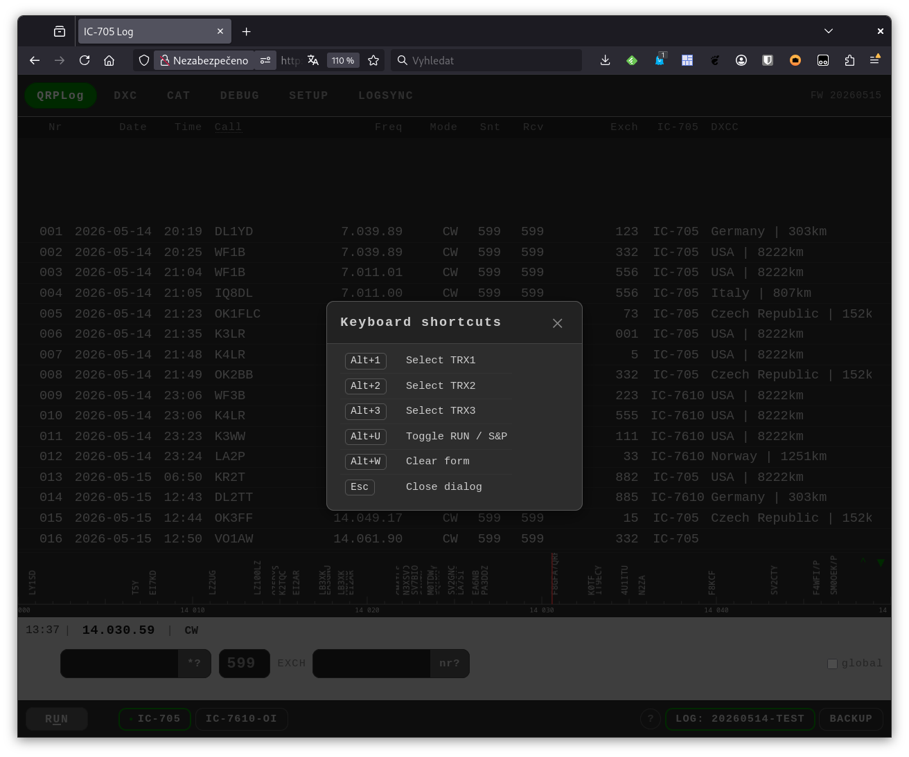
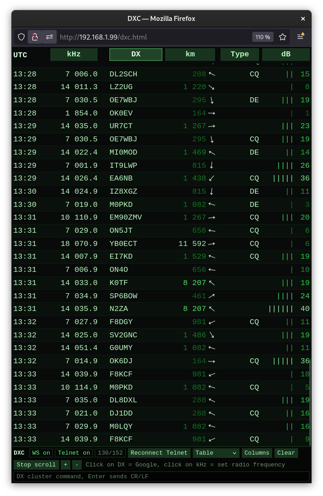
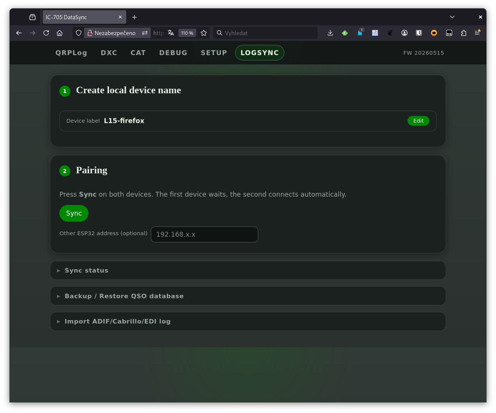
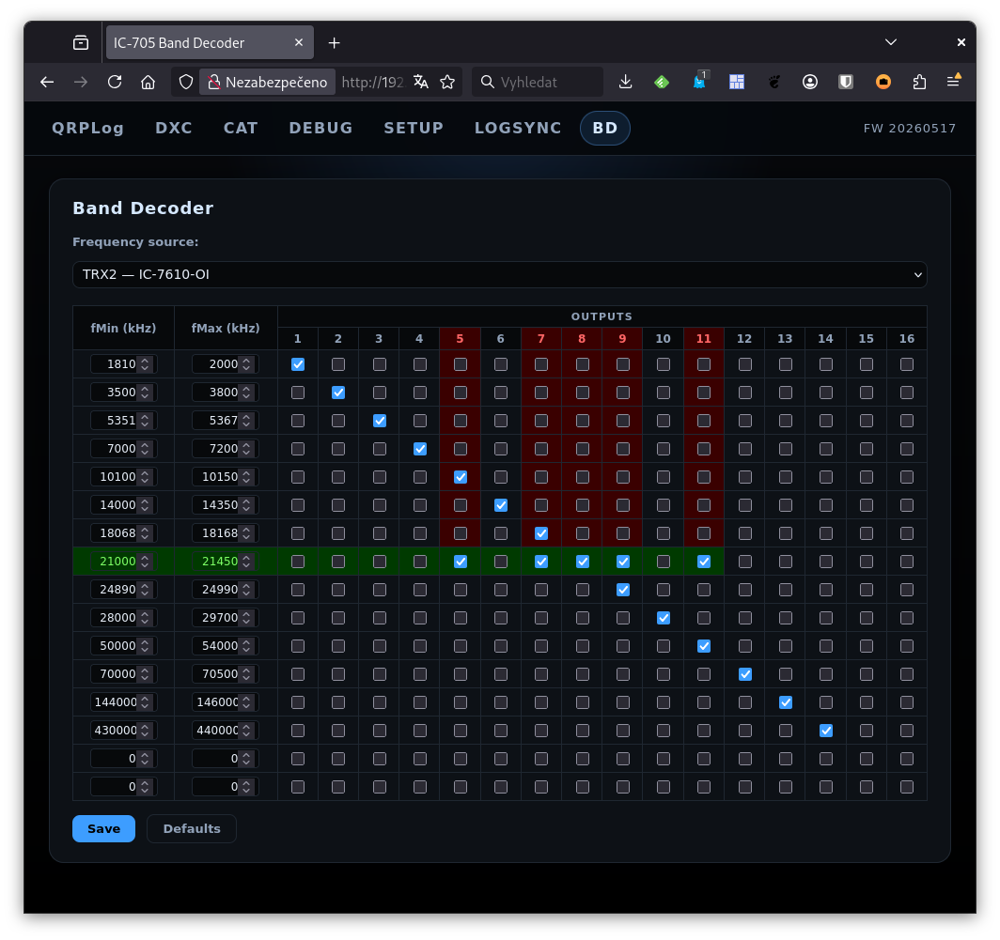

# IC-705 IP Interface — User Manual

The IC-705 IP Interface connects an ICOM IC-705 to your local network via Bluetooth and exposes a browser-based control and logging UI. All pages are served at **`http://ic705.local`** (or the device IP address if mDNS is not available). The navigation bar at the top of every page links to:

| Tab | URL | Purpose |
|-----|-----|---------|
| SETUP | `/setup` | Device configuration |
| CAT | `/` | Radio control |
| QRPLog | `/log` | Contest logging |
| DXC | `/dxc.html` | DX cluster client (opens as a separate window) |
| LOGSYNC | `/datasync` | QSO database synchronisation and import/export |
| BD | `/bd` | Band decoder – frequency to output mapping |
| DEBUG | `/ws-cat` | Raw CI-V WebSocket stream |

---

## 1. SETUP Page

**`http://ic705.local/setup`**

All settings are saved by clicking **Save & Restart** at the bottom of the page. Settings labelled **eeprom** survive a firmware update; settings labelled **spiffs** are stored in the filesystem and also survive updates.

After saving, the device reboots automatically and the browser waits until it comes back online.

### WiFi `eeprom`

| Field | Description |
|-------|-------------|
| SSID 1 / Password 1 | Primary WiFi network. Tried first after every reboot. |
| SSID 2 / Password 2 | Fallback network. The device alternates between the two profiles until it connects. |

If neither network is reachable the device falls back to AP mode.

### Network input ports `eeprom`

| Field | Default | Description |
|-------|---------|-------------|
| HTTP CAT port | 81 | Simple frequency/mode HTTP endpoint for external loggers. |
| CW/FSK UDP port | 89 | Receives ASCII text and keys it as CW (via CI-V) or FSK/RTTY (via GPIO). |
| CAT UDP port | 90 | Receives raw CI-V bytes; currently only RIT clear is implemented. |

### MQTT `eeprom`

| Field | Description |
|-------|-------------|
| Broker IP | Four-octet IP address of the MQTT broker. Set to `0.0.0.0` to disable. |
| Broker port | Default: 1883. |
| Topic TX frequency TRX1 | Topic the device publishes to on every frequency or mode change. |
| Topic RX frequency TRX1 | Topic the device subscribes to for incoming CAT commands. |

Published payload example: `{"freq":14074000,"mode":"USB"}`

### TrxNet `eeprom`

TrxNet is a peer-to-peer telemetry protocol that links IC-705 Interface devices and OI3 keyers over the local network using CoAP/UDP.

| Field | Description |
|-------|-------------|
| Own NET_ID | This device's identity (2-digit hex, e.g. `01`). `00` disables TrxNet. Must be unique on the network. The device name is derived as `705.XX`. On first use the field is auto-filled with the last octet of the device IP address. Use the **Use IP last octet** button at any time to refill it. |
| UDP port | Port for TrxNet discovery and CoAP messages. All devices on the network must use the same port. Default: `5683`. |

Protocol reference: [https://github.com/ok1hra/TrxNet](https://github.com/ok1hra/TrxNet)

### Radio `eeprom`

**USB and CI-V serial baudrate** — serial speed for CI-V data over USB-C. Must match the radio's *USB Serial Baud Rate* setting (IC-705 menu: SET → Connectors → USB Serial).

Up to three transceivers can be configured:

#### TRX1 — Connection: Bluetooth

| Field | Description |
|-------|-------------|
| Label | Name shown in the log UI (max 10 characters). |
| CI-V address | Hex address of the radio (IC-705 default: `A4`). Check MENU → SET → Connectors → CI-V → CI-V Address. |
| Announce WiFi IP via CW on first BT connect | Sends the device IP in Morse code after the first Bluetooth connection — useful when DHCP assigns an unknown address. |

**Bluetooth device name** — custom name advertised over Bluetooth (1–20 characters; letters, digits, spaces, hyphens and underscores are allowed). Defaults to `IC705-XXXXXX` where `XXXXXX` is derived from the device MAC address. The new name takes effect after **Save & Restart**.

#### TRX2 and TRX3 — connection type selector

Each of TRX2 and TRX3 has a **Label** (shown in the log UI) and a connection type selector:

**TrxNet** (active) — connects to an OI3 keyer on the local network via TrxNet.

| Field | Description |
|-------|-------------|
| TrxNet ID | Peer NET_ID of the OI3 keyer (2-digit hex). `00` = disabled. The resolved device name is shown below the field (e.g. `→ OI3.02`). When set, the interface subscribes to the peer's `/hz` and `/mode` topics and forwards CW/frequency commands to it. |

**CI-V** (planned) — direct CI-V connection to a remote radio. This option is shown in the interface but is not yet implemented; it will be enabled in a future firmware release.

### DX Cluster `eeprom`

| Field | Description |
|-------|-------------|
| DXC host | Hostname or IP of the DX cluster telnet server (e.g. `ve7cc.net`). |
| DXC port | Telnet port, commonly 7300 or 23. |
| Callsign | Your callsign sent to the cluster for login. |
| My locator | Maidenhead locator (4 or 6 characters) used for distance and bearing calculations. |

### LOG settings `spiffs`

| Field | Description |
|-------|-------------|
| RST default SSB/FM | Default RS(T) pre-filled for SSB and FM QSOs (e.g. `59`). |
| RST default CW/RTTY | Default RST pre-filled for CW and digital mode QSOs (e.g. `599`). |
| Manual mode for Phone (SSB/FM) | When checked, pressing Enter on an SSB/FM QSO logs it immediately without sending any macro. |
| Blocked DXCC list | One DXCC entity name per line (e.g. `Russia`, `Belarus`, `Kaliningrad`). Matching callsigns are highlighted red in the log journal. When Enter is pressed on a blocked call the call field is cleared and a ⛔ warning is shown for 5 seconds; in RUN mode the CQ macro is re-sent automatically. |

### CW memories `spiffs`

Four free-text slots (CW memory 1–4). The text is keyed when the corresponding memory button is pressed on the CAT page. Maximum 30 characters per slot. In CW mode the text is sent via the IC-705 CW keyer; in RTTY mode it is sent via FSK GPIO.

### Frequency memories `spiffs`

Ten frequency memory slots selectable from the CAT page. Format: frequency in Hz followed by mode, e.g. `14074000 USB` or `144174000 FM`.

### Configuration backup and restore

At the bottom of the SETUP page:

- **Download config** — saves all EEPROM and SPIFFS settings as a dated JSON file (`yyyymmdd-hhmm-ic705-config.json`).
- **Upload config** — restores settings from a previously downloaded JSON file and restarts the device.

---

## 2. CAT Page

**`http://ic705.local/`**

The main radio control view. All controls communicate with the IC-705 in real time over the Bluetooth CI-V connection.

### Frequency and meters

- **Frequency display** — current VFO frequency updated in real time. Click the **FREQ** input field below to type a frequency in Hz and press Enter to QSY.
- **S meter / Power meter** — switches automatically between receive (S meter) and transmit (power/SWR). The secondary bar shows the **supply voltage**.
- **MEM dropdown** — quick QSY to a saved frequency memory. Selects frequency and mode simultaneously.

### MODE, RIT and tune controls

- **MODE selector** — change the radio mode: LSB, USB, AM, CW, RTTY, FM, DV.
- **RIT** — shows the current RIT offset. The **Clear** button zeroes it.
- **Tune slider** — drag to tune up or down from the current frequency. The step size (1 Hz, 10 Hz, 100 Hz, 1 kHz) is selected from the dropdown next to the slider. The slider snaps back to centre on release.

### Sliders

| Slider | Controls |
|--------|---------|
| AF volume | Receiver audio volume (CI-V). |
| KEY SPEED | CW keyer speed (CI-V). |
| RF power | Transmit power output (CI-V). |

### Buttons

| Button | Function |
|--------|---------|
| P.AMP/ATT | Cycles through preamplifier / attenuator settings. |
| VOX | Cycles through VOX states. |
| FIL1/FIL2/FIL3 | Cycles through IF filter selections. |
| PTT | Activates transmit (push to talk). |

### CW text input

Type any text in the **Send CW text** field and press Enter to key it immediately via the IC-705 CW keyer. The **Clear** button empties the field. The radio must be in CW or CW-R mode.

### CW memory buttons

Four buttons (CW 1–CW 4) send the pre-configured CW memory texts defined in SETUP. Content can be edited under **SETUP → CW memories**.

### Status footer

Displays CI-V address, WebSocket connection state, radio on/off state, and firmware version.

---

## 3. QRPLog Page

**`http://ic705.local/log`**

A browser-based contest log. The QSO database is stored in the browser's IndexedDB — it remains on the device where the browser is running and is not sent to the ESP32.

### Log manager — creating and selecting logs

Click the **LOG** button in the bottom bar to open the log manager.

To create a new log, fill in the form at the bottom of the log manager:

| Field | Description |
|-------|-------------|
| Contest name | Name of the contest or activation (e.g. `CQWW`, `SOTA`). Required. |
| My callsign | Your station callsign. Used in CW/RTTY macros as `{mycall}`. Required. |
| Exchange type | What you send as your exchange — selected from a dropdown. See the table below. Click **?** next to the label for a built-in description of each type. |
| Exch value | Visible only when **STATIC** is selected. Enter the fixed exchange text (e.g. `SK1`, `14`, `A`). |
| Exchange preview | Live preview of the exchange string (e.g. `5NN TT1`) shown immediately below the type selector. |
| My locator | Your Maidenhead locator (optional, e.g. `JO70FD`). Required for NRLOC. Also used for QRB and azimuth in the status bar. |
| Starting QSO number | Serial number of the first QSO. Default: 1. |
| CW numbers | **CW abbreviation** checkbox (default: on). When enabled, CW numbers use the 0→T and 9→N abbreviations (e.g. 001 → `TT1`, 599 → `5NN`). Uncheck to send plain digits. |

**Exchange type options:**

| Type | Exchange sent | Typical use |
|------|---------------|-------------|
| NONE | — | Expedition / casual QSO |
| NR | Sequential QSO number (001, 002, …) | Most HF contests |
| NR+UTC | Sequential number + UTC time (e.g. `001-1430`) | NRAU, Baltic, some RTTY contests |
| NR+LOC | Sequential number + your Maidenhead locator (e.g. `001 JO70FD`) | VHF/UHF contests (6 m and above) |
| STATIC | A fixed text you define | Contests with a zone, district, or region exchange |

Click an existing log in the list to switch to it. The active log name and callsign are shown in the log journal header.

### RUN and S&P modes

Toggle between modes with the **RUN / S&P** button in the bottom-left corner or with **Alt+U**.

| Mode | Behaviour |
|------|-----------|
| RUN | Pressing Enter in the Call field sends the CQ macro. After filling Call + Exchange, Enter logs the QSO and sends the TU macro. |
| S&P | Enter in the Call field checks for duplicates. Enter in the Exchange field logs the QSO and sends your exchange. |

### Entering a QSO

1. Type the callsign in the **Call** field. The log checks for duplicates automatically and shows the result in the dupe panel.
2. Press Space in the Call field to jump to the Exchange field (or Tab to RST first).
3. Fill in **RST** (pre-filled from SETUP defaults).
4. Fill in the **Exchange** field.
5. Press **Enter** to log and send the TU macro.

The **nr?** button requests a repeat of the exchange; **prev exch** re-sends the previous exchange macro.

### CW/RTTY macros

Macros are generated automatically based on mode and RUN/S&P state:

| Macro | CW (RUN) | RTTY (RUN) |
|-------|----------|------------|
| CQ | `OK1HRA OK1HRA TEST` | `OK1HRA OK1HRA OK1HRA TEST` |
| TXEXCH | `{call} {rst} {exchange}` | same |
| TU | `tu OK1HRA` | `{call} tu OK1HRA` |

When the **CW abbreviation** option is enabled (the default), RST is sent as `5NN` and QSO numbers use T for 0 and N for 9 (e.g. `TT1`, `TT7`, `1N2`). Uncheck *CW numbers* in the log manager to send plain digits.

The exchange field of TXEXCH depends on the exchange type set in the log: a serial number (NR), serial+UTC (NR+UTC), serial+locator (NR+LOC), or a fixed string (STATIC). For NR+LOC and VHF contests the locator from *My locator* is appended automatically.

**Corrected callsign (CALLTU):** In RUN mode, if you edit the callsign in the Call field after TXEXCH has already been sent, pressing Enter will first transmit `{call} tu` (CW) or `{call} tu {mycall}` (RTTY) to announce the corrected call before logging the QSO. The regular TU macro is suppressed in this case.

A preview of the macro that Enter would send is shown above the bottom button bar.

### Status bar

The status bar below the entry fields shows:

- **UTC time**
- **Frequency and mode** from the active TRX (or a manual entry field when no TRX is connected)
- **DXCC information** — continent, country, prefix, CQ zone, ITU zone, UTC offset, QRB distance, and azimuth for the callsign in the Call field
- **Exchange locator preview** (6 m and above only) — when a valid Maidenhead locator is typed in the Exchange field and Space is pressed, a temporary group appears in the status bar showing the parsed locator, azimuth to it, and QRB distance in km. The bearing arrow rotates accordingly. The group disappears when the form is cleared.

### Band map

A compact band map is shown above the status bar. It displays DX cluster spots around the current frequency. The bandwidth (50 / 100 / 200 kHz) is selectable with the **^** button. Click the **▼** button to collapse the band map. Clicking a spot tunes the radio to that frequency.

### TRX selection

The **TRX1 / TRX2 / TRX3** buttons switch the active transceiver. TRX2 and TRX3 require additional backends configured in **SETUP → Radio**.

### Log journal

The journal on the left lists all logged QSOs. Click the **Call** column header to open a search box. Enable **global** to search across all log files in the database.

### Backup

Click **BACKUP** to download the entire QSO database as a JSON file. This is the same export as the one on the LOGSYNC page.

### Keyboard shortcuts

**Global shortcuts:**

| Shortcut | Action |
|----------|--------|
| `Alt+1` | Select TRX1 |
| `Alt+2` | Select TRX2 |
| `Alt+3` | Select TRX3 |
| `Alt+U` | Toggle RUN / S&P |
| `Alt+W` | Clear the entry form |
| `Alt+Enter` | Log the current QSO without sending any memory |
| `Esc` *(dialog open)* | Close dialog |
| `Esc` *(no dialog)* | **Abort CW / RTTY TX immediately** — TRX1: CI-V stop command; TRX2/3: clears k3ng keyer buffer |

Press the **?** button in the bottom bar to show this table at any time.

**Entry field shortcuts** (click the **?** button next to the hint area in the input row):

| Field | Key | Action |
|-------|-----|--------|
| Call | `Space` | Search the log for a partial call match (duplicate check) |
| Call | `Enter` | Send exchange memory (RUN mode), or send CQ when the field is empty |
| Exchange | `Enter` | Log the QSO; in S&P mode sends your exchange first |
| Exchange | `Space` after locator | On 6 m and above: parse the Maidenhead locator and show azimuth and distance in the status bar |

---

## 4. DXC Page

**`http://ic705.local/dxc.html`** — opens as a separate popup window.

A real-time DX cluster client. The ESP32 maintains a Telnet connection to the configured cluster server (set up in **SETUP → DX Cluster**).

### Views

Select the view from the dropdown in the bottom bar:

| View | Description |
|------|-------------|
| Table | Spot list with columns: UTC, kHz, DX, km, Spotter, Type, dB, WPM, Info. |
| Raw | Raw telnet output text. |
| Histogram | Bar chart showing number of visible spots per band. |

### Columns

Click **Columns** to show or hide individual table columns.

### Filters

Each column header with a button opens a filter menu:

| Filter | Options |
|--------|---------|
| kHz (band) | Enable or disable individual amateur bands. |
| DX | Plain text or regex match on the DX callsign. |
| km | Distance range slider. |
| Type | CQ / DE / EMPTY spot types. |
| dB | Signal strength range slider. |

### Interacting with spots

- **Click a frequency** — tunes the radio to that frequency (CI-V command sent to the active TRX).
- **Click a DX callsign** — opens a Google search for that call in a new browser tab.

### Command input

Type a DX cluster command (e.g. `sh/dx 20` or `set/filter`) in the command field and press Enter. The command is sent to the cluster server with a CR/LF terminator.

### Toolbar buttons

| Button | Function |
|--------|---------|
| Reconnect Telnet | Manually re-establish the Telnet connection to the cluster. |
| Clear | Clear the spot table. |
| Stop scroll / Auto scroll | Toggle automatic scrolling to new spots. |
| + / − | Zoom in/out the table font size. |

---

## 5. LOGSYNC Page

**`http://ic705.local/datasync`**

Manages QSO database synchronisation between multiple browsers on the same network, and provides import/export of log files.

### Storage warning (Firefox)

Firefox may clear IndexedDB storage when it closes. If a warning banner appears at the top of the page:

- **Easiest fix:** bookmark the page (`Ctrl+D`). Firefox protects storage for bookmarked origins automatically.
- **Alternative:** go to *Settings → Privacy & Security → Cookies and Site Data → Manage Exceptions* and add the device address as **Allow**.
- **Fallback:** export a backup after every session using the Backup / Restore section below.

### Step 1 — Device label

Set a human-readable name for this browser instance (e.g. `Shack tablet`). The label is shown on the other device during pairing so you know which device is connecting.

### Step 2 — Pairing and sync

Press **Sync** on both devices. The first device creates a session and waits; the second device finds the session and connects automatically.

If the two browsers connect to **different** ESP32 devices, enter the IP address of the other ESP32 in the *Other ESP32 address* field before pressing Sync.

After connecting, the devices exchange all QSOs that the other side is missing. The sync is additive — no records are deleted.

### Sync status

Expand the **Sync status** section to see:

| Field | Meaning |
|-------|---------|
| Device ID | Unique identifier of this browser instance. |
| Local QSOs | Number of QSOs in the local database. |
| Remote QSOs | Number of QSOs received from the remote device in the last session. |
| Known devices | Number of distinct browser instances ever synced with. |
| Est. DB size | Estimated IndexedDB storage usage. |
| Phase | Current sync state: Idle / Offer / Sync / Done. |
| Sent / Received | QSOs exchanged in the current session. |
| Errors | Should be 0. |

### Backup / Restore QSO database

- **Export backup** — downloads all QSOs, logs, settings and sync metadata as a dated JSON file (`yyyymmdd-hhmm-QSO-database.json`).
- **Import backup** — restores from a previously exported file. Records with the same key are overwritten; no data is deleted. Safe to repeat (idempotent).

### Import ADIF / Cabrillo / EDI log

Import QSOs from an existing log file into a new log in the database. Supported formats:

- **ADIF** (`.adi`, `.adif`)
- **Cabrillo** (`.log`, `.cbr`)
- **EDI / REG1TEST** (`.edi`)

The format is detected automatically. Click *Select log file…* and choose the file.

---

## 6. BD Page

**`http://ic705.local/bd`**

The Band Decoder page maps the current operating frequency to up to 16 binary outputs driven by a shift register (SPI: clock GPIO 15, latch GPIO 13, data GPIO 14). It is available on hardware revision 4 and above.

### Frequency source

The **Source** dropdown in the toolbar selects which transceiver's frequency is used to determine the active band. Only TRX entries whose label has been changed from the default are shown. Selecting a source starts real-time polling:

| Source | Poll endpoint | Interval |
|--------|---------------|----------|
| TRX1 | `/state` | 1 s |
| TRX2 / TRX3 | `/api/status` | 2 s |

### Band table

The table has **16 rows**, each representing one band segment. For each row you set:

| Column | Description |
|--------|-------------|
| From (Hz) | Lower edge of the frequency range. |
| To (Hz) | Upper edge of the frequency range. |
| OUT 1–16 | Checkbox for each of the 16 shift-register outputs. Check the outputs that should be active when the radio is inside this band segment. |

When the current frequency falls within a row's range, that row is highlighted and the corresponding outputs are driven high. Only one row is active at a time (first match wins).

### Buttons

| Button | Function |
|--------|---------|
| Save | Stores the current table and source selection to EEPROM. |
| Defaults | Reloads the factory IARU band plan (160 m – 70 cm, 16 entries) and resets all outputs to unchecked. |

---

## 7. DEBUG Page

**`http://ic705.local/ws-cat`**

Shows a raw WebSocket stream of all CI-V frames passing between the ESP32 and the IC-705. Intended for development and troubleshooting — use it to verify that the Bluetooth connection is active, frequency polling is working, and CI-V commands are being acknowledged.

---

*Document updated 2026-05-17*
